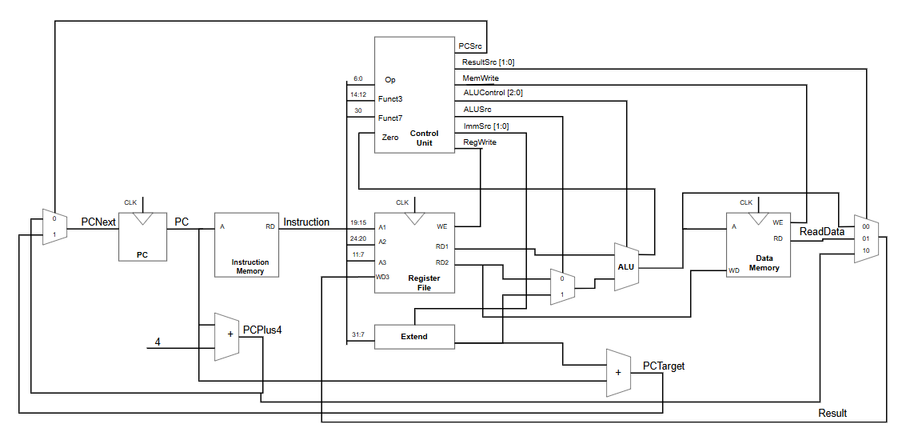
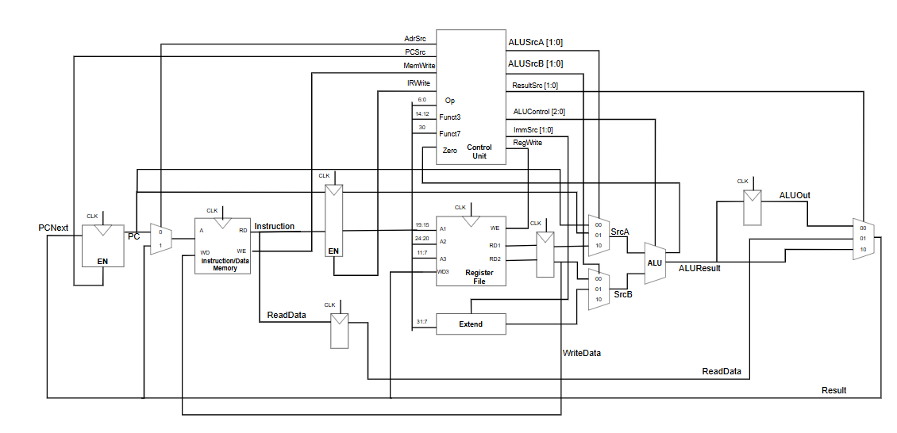
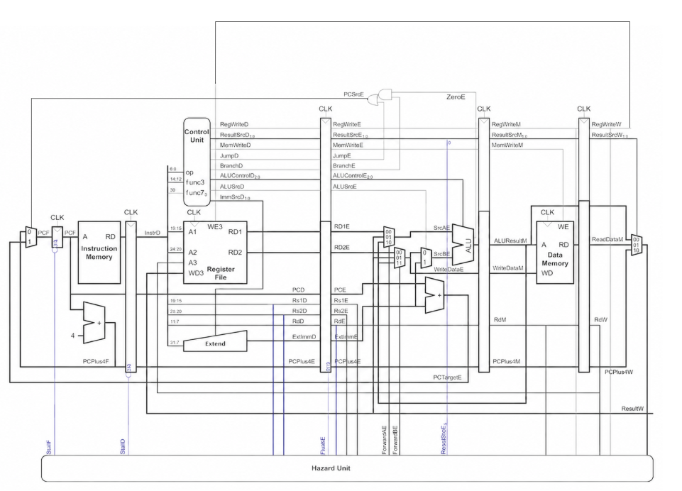

# 🚀 RISC-V RV32I Processor Design


## 📖 Overview

This project focuses on the hardware design and implementation of a processor based on the open RISC-V Instruction Set Architecture (ISA).

The processor implements a subset of the **RV32I base integer instruction set**, using a 32-bit Program Counter (PC), 32 general-purpose 32-bit registers, and a 32-bit datapath.

The design follows the RISC-V **load/store architecture**, where arithmetic and logical operations are primarily performed on registers, while memory is accessed through dedicated load and store instructions.

The project explores the development of the processor microarchitecture through three implementations:

- Single-Cycle
- Multicycle
- 5-Stage Pipeline

These architectures implement the same RV32I instruction set but differ in how datapath resources, control signals, and instruction execution are organized.

---

## 🏗️ Processor Architectures

The project demonstrates the development of the processor microarchitecture from a simple Single-Cycle implementation to a higher-throughput pipelined processor.

### 1. Single-Cycle

The **Single-Cycle processor** completes an entire instruction within one clock cycle.

Its datapath includes the main components:

- Program Counter
- Instruction Memory
- Register File
- Immediate Extender
- ALU
- Data Memory
- Control Unit
- Multiplexers

All operations required by an instruction must be completed before the next active clock edge.

The main advantage of this architecture is its simplicity.

```text
CPI = 1
```

However, the clock period must be long enough for the slowest instruction path, typically a load instruction that passes through Instruction Memory, Register File, ALU, Data Memory, and the Write Back path.

Instruction Memory and Data Memory are also separated because both may need to be accessed within the same clock cycle.

---

### 2. Multicycle

The **Multicycle processor** divides the execution of an instruction into multiple shorter clock cycles.

A typical instruction execution sequence can be represented as:

```text
Fetch → Decode → Execute → Memory → Write Back
```

The exact number of cycles depends on the instruction type.

Unlike the Single-Cycle architecture, hardware resources can be reused across different cycles.

For example, the ALU can be used to:

```text
Fetch:
PC + 4

Decode:
PC + Immediate

Execute:
Arithmetic / Logic Operation
```

The Multicycle architecture also introduces intermediate registers to preserve data between cycles.

Typical intermediate registers include:

```text
Instruction Register
OldPC
A
B
ALUOut
Data / MDR
```

The Control Unit is implemented using a **Finite State Machine (FSM)**.

A typical set of states includes:

```text
FETCH
DECODE
MEM_ADR
MEM_READ
MEM_WB
MEM_WRITE
EXEC_R
EXEC_I
ALU_WB
JAL
BEQ
```

Because instruction fetch and data memory access occur in different cycles, Instruction Memory and Data Memory can also be combined into a shared memory.

---

### 3. 5-Stage Pipeline

The **Pipelined processor** divides instruction execution into five stages:

```text
IF → ID → EX → MEM → WB
```

where:

- **IF** — Instruction Fetch
- **ID** — Instruction Decode
- **EX** — Execute
- **MEM** — Memory Access
- **WB** — Write Back

Multiple instructions can be processed simultaneously at different pipeline stages.

For example:

```text
Cycle 1: I1-IF
Cycle 2: I1-ID   I2-IF
Cycle 3: I1-EX   I2-ID   I3-IF
Cycle 4: I1-MEM  I2-EX   I3-ID   I4-IF
Cycle 5: I1-WB   I2-MEM  I3-EX   I4-ID   I5-IF
```

After the pipeline is filled, the ideal throughput approaches:

```text
1 instruction / clock cycle
```

or approximately:

```text
CPI ≈ 1
```

The pipeline uses four intermediate pipeline registers:

```text
IF/ID
ID/EX
EX/MEM
MEM/WB
```

These registers preserve datapath values, register addresses, and control signals while instructions move through the pipeline.

An important rule is that control signals must travel through the pipeline together with their corresponding instruction.

---

## 🛠️ Supported Instructions

The current processor design implements the following RV32I instructions.

### Arithmetic and Logical Instructions

```assembly
add
sub
and
or
slt
addi
```

### Memory Access Instructions

```assembly
lw
sw
```

### Control Flow Instructions

```assembly
beq
jal
```

These instructions cover the main instruction formats used in the current implementation:

```text
R-type
I-type
S-type
B-type
J-type
```

---

## ⚙️ ALU Operations

The ALU supports the following operations:

| ALUControl | Operation |
|------------|-----------|
| `0000` | ADD |
| `0001` | SUB |
| `0010` | OR |
| `0011` | AND |
| `0101` | SLT |

The ALU also generates status signals:

```text
Zero
Carry
Negative
Overflow
```

The ALU is used not only for arithmetic and logical instructions but also for address calculation and branch comparison.

Examples:

```assembly
addi x1, x0, 5
```

uses the ALU to calculate:

```text
0 + 5
```

while:

```assembly
lw x9, 0(x8)
```

uses the ALU to calculate the memory address:

```text
x8 + 0
```

and:

```assembly
beq x1, x2, offset
```

can use subtraction to determine whether the operands are equal.

---

## 🎛️ Control Unit

The Control Unit is responsible for decoding instructions and generating control signals for the datapath.

The Control Unit is divided into two main parts:

```text
Main Decoder
ALU Decoder
```

The **Main Decoder** uses the instruction opcode to generate signals such as:

```text
RegWrite
ResultSrc
MemWrite
Branch
Jump
ALUSrc
ImmSrc
ALUOp
```

The **ALU Decoder** uses:

```text
ALUOp
funct3
funct7
opcode
```

to generate:

```text
ALUControl
```

For branch and jump instructions, the PC selection signal can be generated as:

```verilog
PCSrc = Jump | (Branch & Zero);
```

In the pipelined architecture, the corresponding branch decision is performed in the Execute stage:

```verilog
PCSrcE = JumpE | (BranchE & ZeroE);
```

---

## ⚠️ Pipeline Hazard Handling

Because multiple instructions are processed simultaneously, the pipelined processor must handle instruction dependencies.

A dedicated **Hazard Unit** is implemented to handle:

- Data Hazards
- Forwarding
- Load-Use Hazards
- Pipeline Stalls
- Pipeline Flushes
- Control Hazards

### Data Hazard

A data hazard occurs when an instruction requires a result that has not yet been written back to the Register File.

Example:

```assembly
add x5, x1, x2
sub x6, x5, x3
```

The `sub` instruction requires the latest value of `x5`, but the preceding `add` instruction may not have reached the Write Back stage yet.

To avoid waiting for Write Back, the processor uses **forwarding**.

The main forwarding signals are:

```text
ForwardAE
ForwardBE
```

with the following selection:

```text
00 → Register File value
01 → Write Back result
10 → Memory-stage ALU result
```

Forwarding allows the newest result to be sent directly to the ALU inputs in the Execute stage.

### Load-Use Hazard

Forwarding cannot completely solve an immediate dependency after a load instruction.

Example:

```assembly
lw  x5, 0(x1)
add x6, x5, x2
```

The loaded value becomes available only after the Memory stage, while the following `add` instruction needs it in the Execute stage.

Therefore, the Hazard Unit inserts a one-cycle stall.

The main signals are:

```text
StallF = 1
StallD = 1
FlushE = 1
```

`StallF` prevents the Program Counter from updating.

`StallD` keeps the IF/ID pipeline register unchanged.

`FlushE` inserts a bubble into the Execute stage.

A simplified load-use detection condition is:

```verilog
lwStall =
    (RdE != 5'd0) &&
    ((Rs1D == RdE) || (Rs2D == RdE)) &&
    ResultSrcE[0];
```

### Control Hazard

Control hazards occur when branch or jump instructions change the Program Counter after subsequent instructions have already entered the pipeline.

The current design handles control hazards produced by:

```assembly
beq
jal
```

The PC selection signal is generated in the Execute stage:

```verilog
PCSrcE = JumpE | (BranchE & ZeroE);
```

When:

```text
PCSrcE = 1
```

instructions fetched from the incorrect path must be removed.

The design uses:

```text
FlushD
FlushE
```

with:

```verilog
FlushD = PCSrcE;
FlushE = lwStall | PCSrcE;
```

This prevents incorrectly fetched instructions from modifying the architectural state.

---

## 📊 Architecture Diagrams

The following diagrams illustrate the datapath organization of each processor architecture.

### Single-Cycle Architecture

<p align="center">
  
</p>

### Multicycle Architecture

<p align="center">
  
</p>

### 5-Stage Pipeline Architecture

<p align="center">
  
</p>

---

## 🧪 Simulation & Verification

The processor architectures are verified through HDL simulation using dedicated testbenches.

The verification process includes:

- Arithmetic instruction execution
- Logical instruction execution
- Register File read and write operations
- Immediate generation
- Load and store operations
- Branch execution
- Jump execution
- Program Counter updates
- Data forwarding
- Load-use hazard detection
- Pipeline stalling
- Bubble insertion
- Pipeline flushing
- Pipeline control signal propagation

Waveform analysis is used to verify datapath values and control signals at each clock cycle.

A representative instruction sequence is:

```assembly
addi x1, x0, 5
addi x2, x0, 3
add  x3, x1, x2
sub  x4, x3, x2
and  x5, x3, x1
or   x6, x1, x2
slt  x7, x2, x1
```

The expected register values are:

```text
x1 = 5
x2 = 3
x3 = 8
x4 = 5
x5 = 0
x6 = 7
x7 = 1
```

Additional instruction sequences are used to verify memory operations and pipeline hazards.

Example memory operations:

```assembly
addi x8, x0, 16
sw   x3, 0(x8)
lw   x9, 0(x8)
```

Expected result:

```text
Memory[0x10] = 8
x9 = 8
```

Example load-use hazard:

```assembly
lw  x9, 0(x8)
add x13, x9, x1
```

Expected result:

```text
x13 = 13
```

The Hazard Unit must insert a one-cycle stall before the dependent instruction proceeds.

Branch and jump instructions are also tested to verify pipeline flushing.

---

## 📘 Theory Documentation

A detailed theoretical document is provided for the processor architectures implemented in this project.

The document covers:

- RISC-V and RV32I fundamentals
- Load/Store architecture
- Register File
- Program Counter
- RISC-V instruction formats
- Immediate generation
- ALU
- Control Unit
- Single-Cycle architecture
- Multicycle architecture
- Finite State Machine control
- 5-stage Pipeline architecture
- Pipeline registers
- Data hazards
- Forwarding
- Load-use hazards
- Pipeline stalls
- Bubble insertion
- Control hazards
- Pipeline flushing
- Hazard Unit

📄 **[Read the RISC-V RV32I Processor Theory](docs/RISC-V_RV32I_Processor_Theory.pdf)**

---

## 📁 Project Structure

```text
📦 RISC-V-Project
│
├── 📂 Single_Cycle/
│   ├── 📂 src/
│   └── 📂 tb/
│
├── 📂 Multicycle/
│   ├── 📂 src/
│   └── 📂 tb/
│
├── 📂 Pipeline/
│   ├── 📂 src/
│   └── 📂 tb/
│
├── 📂 docs/
│   ├── 📂 images/
│   │   ├── single_cycle.png
│   │   ├── multicycle.png
│   │   └── pipeline.png
│   │
│   └── RISC-V_RV32I_Processor_Theory.pdf
│
├── 📂 asm/
│   └── test_programs/
│
└── 📜 README.md
```

Each processor architecture is organized independently so that its datapath, control logic, and simulation results can be studied and tested separately.

---

## 🔧 Development Tools

The processor is designed and verified using:

- **Verilog HDL**
- **AMD/Xilinx Vivado**
- **Vivado Block Design**
- **Vivado Behavioral Simulation**

---

## 🎯 Project Purpose

This project is developed for educational purposes to study processor microarchitecture and understand how the same RISC-V ISA can be implemented using different datapath and control organizations.

The development process follows:

```text
RV32I
  │
  ▼
Single-Cycle
  │
  ▼
Multicycle
  │
  ▼
5-Stage Pipeline
  │
  ▼
Pipeline with Hazard Handling
```

The project demonstrates the trade-offs between implementation simplicity, hardware reuse, clock period, CPI, throughput, and control complexity while maintaining the same underlying RISC-V instruction set architecture.
